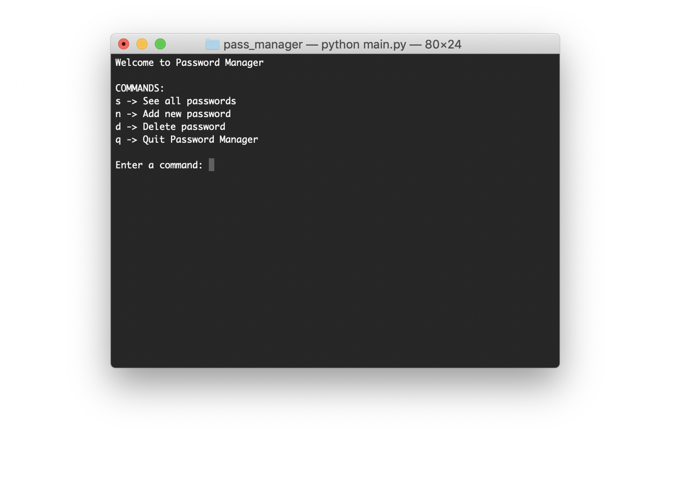

# Password Manager

## General info
A simple Python program to store, display, and delete saved passwords. No commercial application is safer than a simple locally stored program protected by a memorable master password.

## Technologies
- Python 3
- sqlite3

## Preview

